# Kerala Blockchain Academy Innovation Club - Amrita Chapter 
    
  

[Kerala Blockchain Academy Innovation Club (KBAIC)](https://ic.kba.ai/) is a novel initiative by [Kerala Blockchain Academy (KBA)](https://kba.ai/) to help students from academic institutions across the country to explore deep into the potential of blockchain technology. KBAIC provides an opportunity to work closely with experts and experiment with the latest advancements in this domain. This will also help students to build their careers in the disruptive world of blockchain.

### Chapter In-Charge 

**Chairperson:**   
  [**Prof. M. Sethumadhavan**]()  

**Faculty Coordinator:**    

   [**Mr. Ramaguru Radhakrishnan**]()    

**Campus Student Ambassadors**    

<table>
<tbody>
  <tr>
    <td align="center"> <a href="">   <b>Ms. Gandavaram Anuhya</b></a>          </td>
    <td align="center">    <a href=""><b>Ms. Roshni V</b></a>       </td>
  </tr>
</tbody>
</table>

**Executive Members**    

|    [Mr. Khandagale Swapneel Raosaheb]()       |    [Mr. Ruthwik Krishna Bandreddy]()        |    [**Mr. Vinayak R**]()       |
|:---------:|:---------------:|:---------:|
| 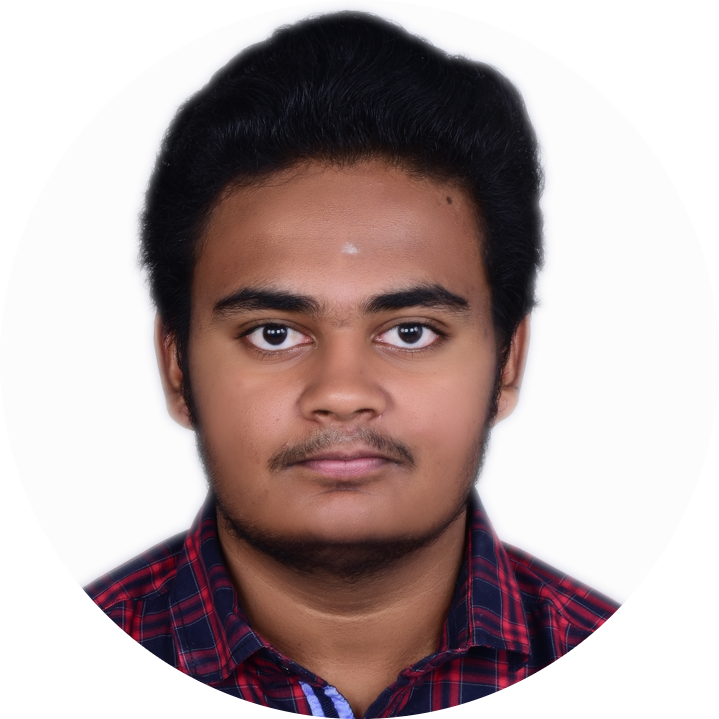   [**Mr. Suganth Sarvesh**]()       | 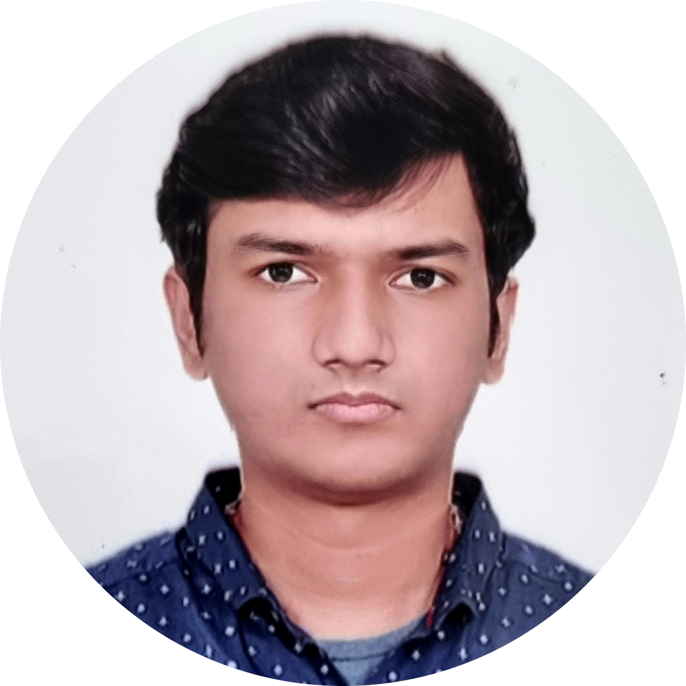   [**Mr. Sourabh Sasikanthan**]()       |

**Members** 

|    [Mr. P Gnanendra Prasad]()       | 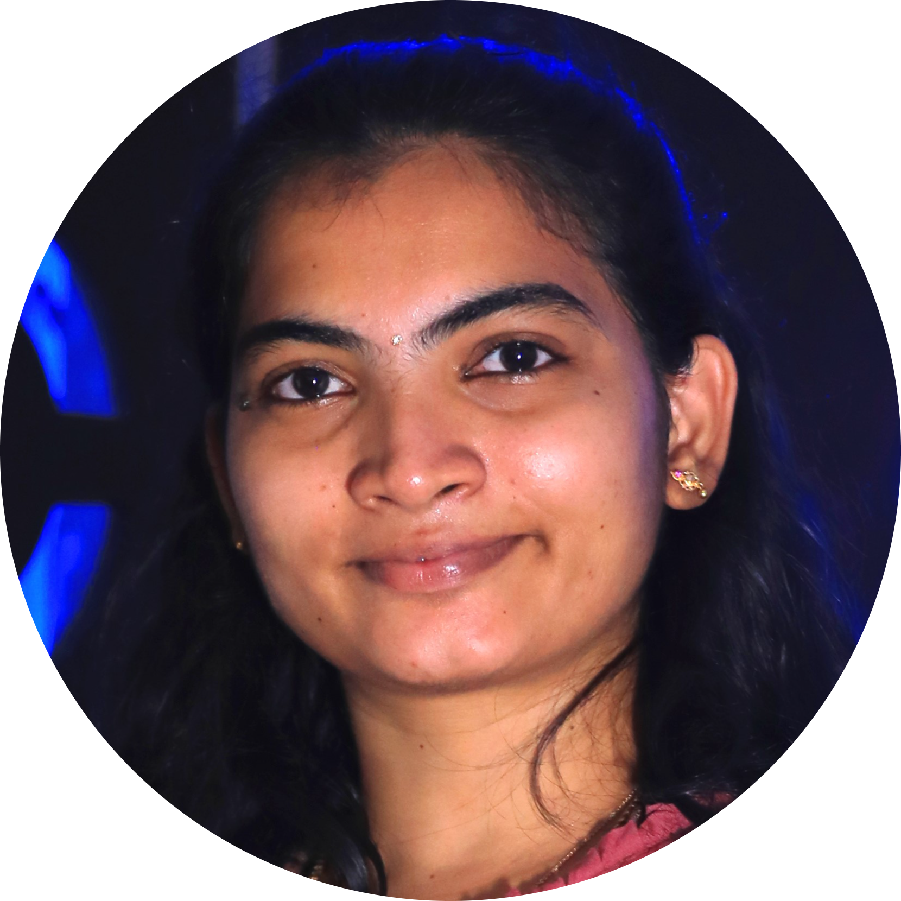   [Ms. Srikalaivani P]()       |    [Mr. Aravinth Raj S]()        |
|:--------------------:|:---------------------:|:---------------------:|
|    [**Mr. Aswhin Prashanth Parthiban**]()       |    [**Mr. Mohamed Feroz Khan D**]()       | 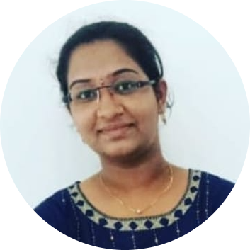   [**Ms. Pothuri Lakshmi_Harika**]()       | 
| 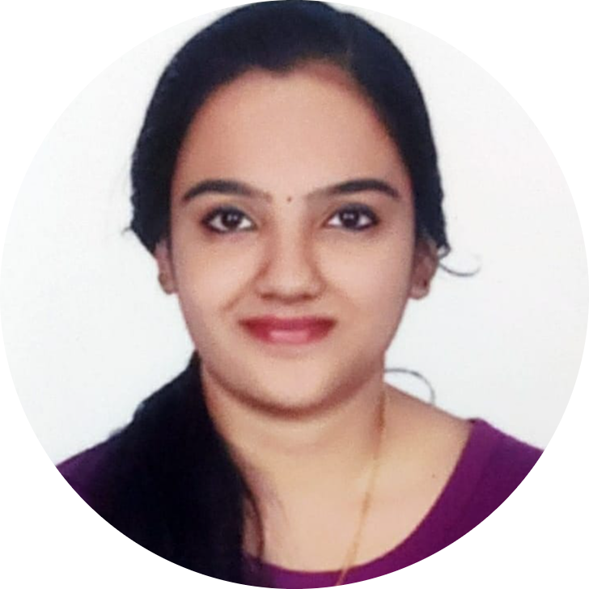   [**Ms. H Nikhitha**]()       | 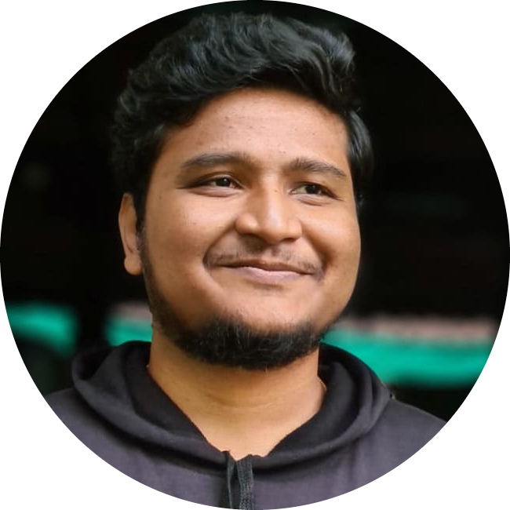   [**Mr. Shanthosh K P**]()       | 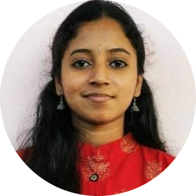   [**Ms. T k Vrinda**]()       | 
| 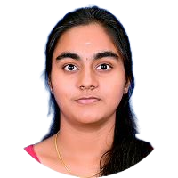   [**Ms. M Harshavarthinie**]()    |    [**Mr. M Hemvarshan**]()        | 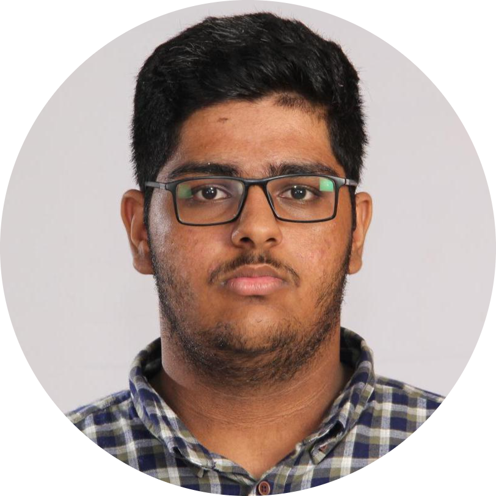    [**Mr. Vishwanath Singh**]()    |
|    [**Mr. As Deepan**]()       | 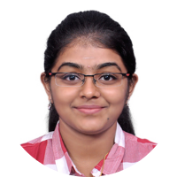   [**Ms. Deepthi J**]()       | 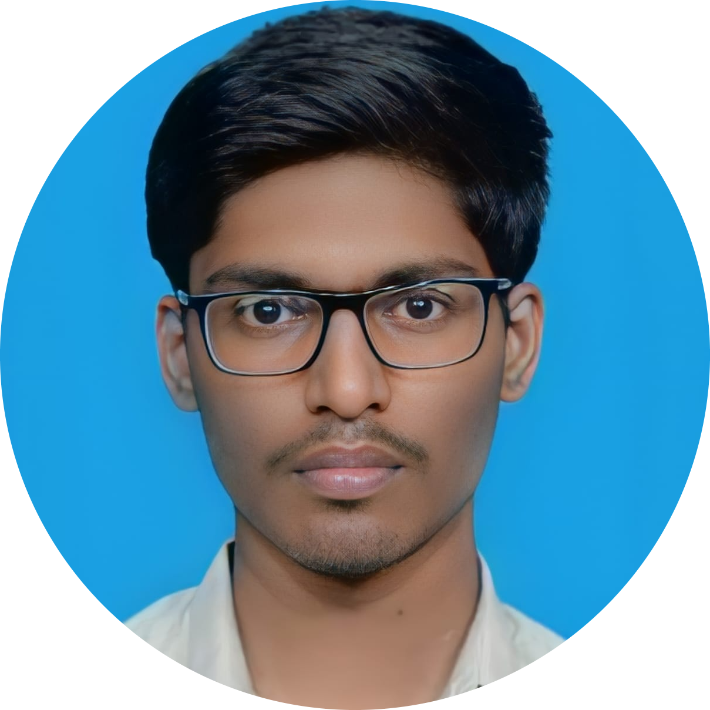   [**Mr. P. Jivan Prasadd**]()       | 
|    [**Mr. Manbendra Satpathy**]()       | 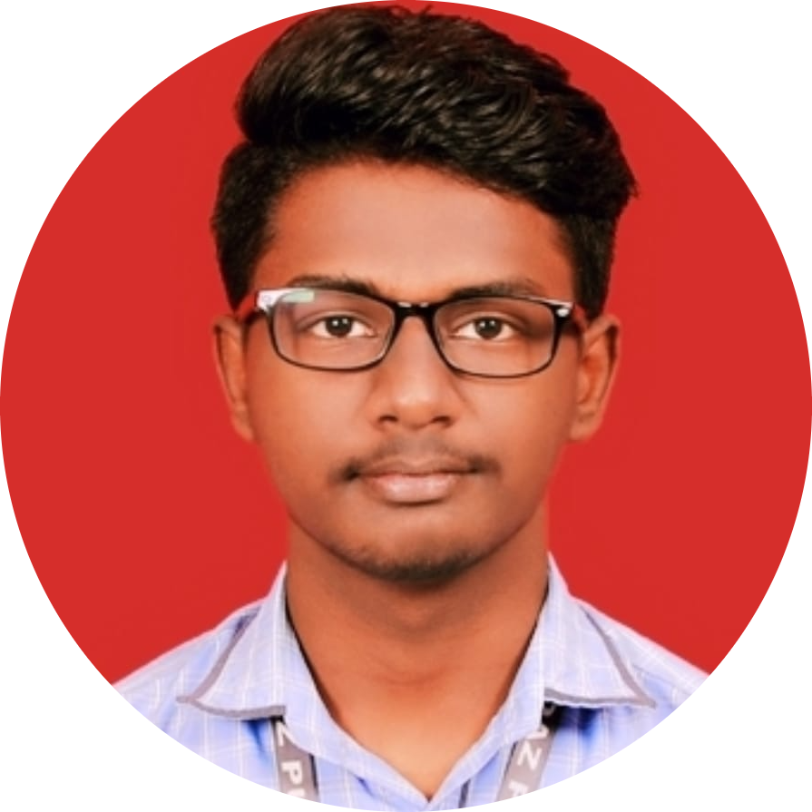   [**Mr. Ram Surya Suresh Kumar**]()       | 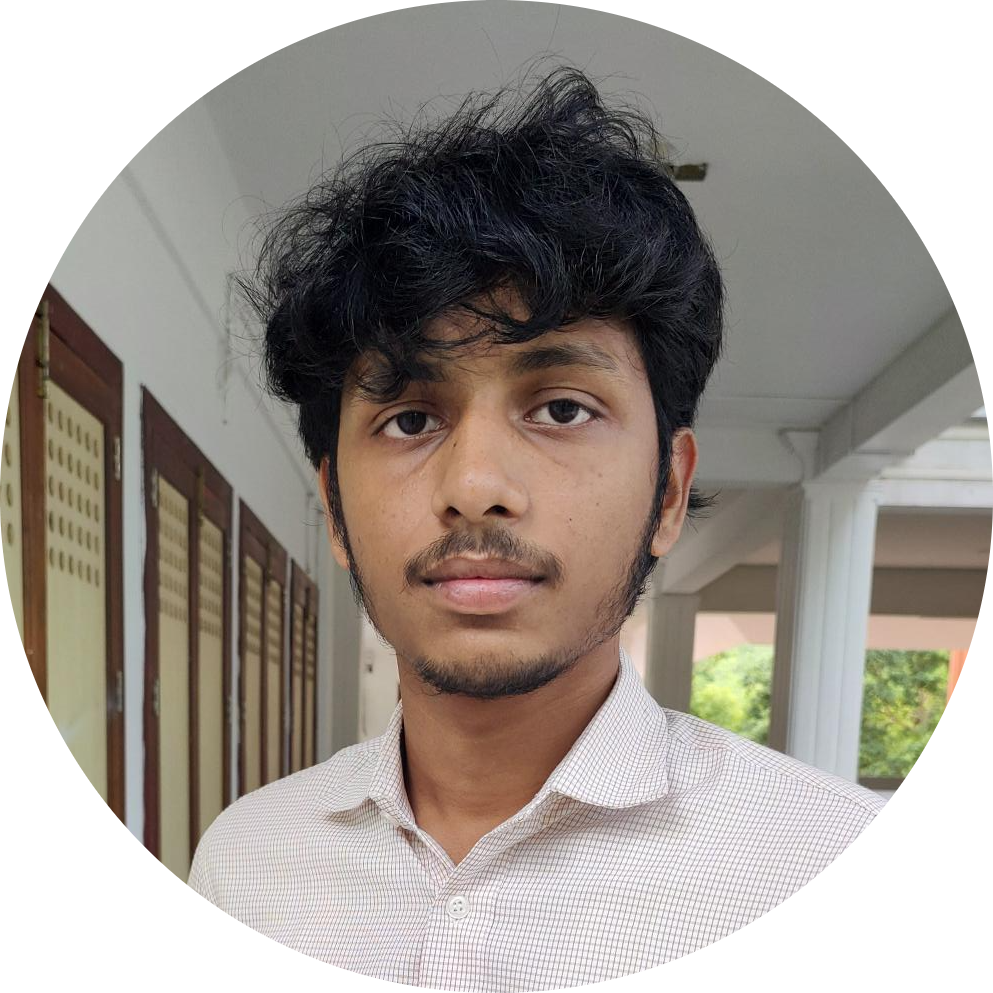   [**Mr. Yaswanth Gadamsetti**]()       | 
| 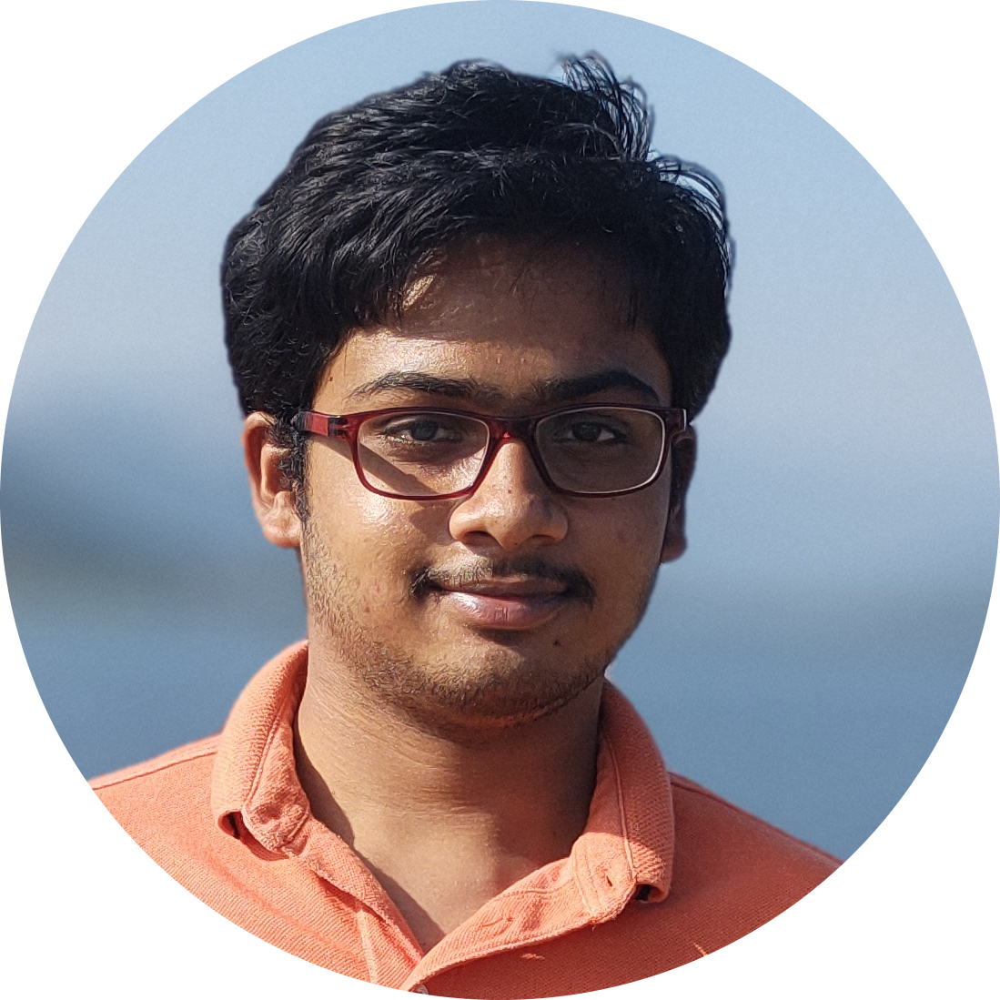   [**Mr. Tippireddy Pavan Kumar Reddy**]()       |    [**Mr. Nithin S**]()        | 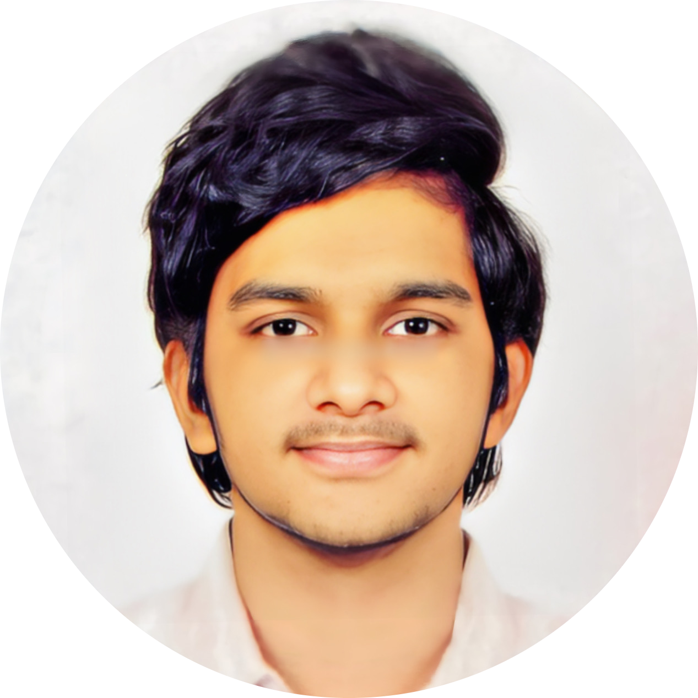   [**Mr. Venkata Revan Nagireddy**]()       |
|    [**Mr. Sushmanth V M**]()        | 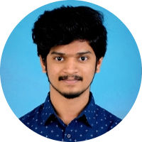   [**Mr. Vivek Veera M C**]()       |

